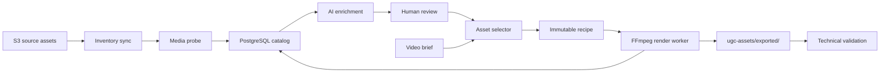

# Project Overview

## Objective

Create a controlled AI media-generation system for Big City Travel Guide that can answer a brief such as “make a 20-second Tokyo food Reel” by selecting appropriate assets, producing a deterministic edit plan, rendering a vertical video, and recording exactly what was used.

This is a media pipeline with AI-assisted decisions—not an unconstrained prompt that edits the bucket directly.

## Current baseline

The refreshed live S3 inventory contains 73 non-empty media files:

- 6 app recordings;
- 36 B-roll clips;
- 31 reaction objects;
- 40 assets associated with New York;
- 2 assets associated with Tokyo; and
- no uploaded music, caption, or generated-output files.

The reaction uploads contain 14 byte-identical cross-folder pairs. They represent
17 unique reaction payloads rather than 31 unique performances. All keys may remain
registered, but selection must deduplicate by content fingerprint.

The current PostgreSQL table is a useful catalog seed, but it mixes user-authored semantics, technical metadata, and workflow state. It also stores duration as text and has no render lineage.

## System boundary

Version 1 includes:

- S3 inventory discovery;
- metadata extraction and enrichment;
- human review;
- asset search and eligibility filters;
- deterministic video recipes;
- rendering, captions, voiceover/music hooks, and manifests;
- generated-media export beneath `ugc-assets/exported/`; and
- usage and render lineage.

Version 1 does not include:

- automatic social-network publishing;
- engagement/download attribution;
- autonomous deletion or movement of source objects;
- rights inference from visual content;
- training a recommendation model; or
- guaranteed identification of a city/place solely from pixels.

## Initial deployment target

The initial implementation is designed to run on the EC2 server that hosts or has
private access to PostgreSQL. That minimizes database exposure and simplifies the
first operational deployment. It does not require the renderer and database to
remain on the same machine forever.

Recommended initial EC2 components:

- inventory/enrichment application;
- scheduled inventory job;
- queue worker;
- `ffmpeg` and `ffprobe`;
- PostgreSQL client connection over localhost or the private VPC;
- IAM instance role with read access to `ugc-assets/` and write access limited to
  `ugc-assets/exported/`; and
- system service/container supervision, structured logs, and bounded local scratch
  storage.

Do not put static AWS access keys in configuration files. Use the EC2 instance
role. Rendering can later move to separate autoscaled workers without changing the
catalog or recipe model.

## Architecture

## Design principles

1. **Preserve originals.** Never overwrite a source object.
2. **Separate observed from inferred data.** Codec/duration come from tools; scene/place/tags may come from people or AI.
3. **Make generation reproducible.** Save input IDs, trims, ordering, transforms, text, audio mix, model/prompt versions, and renderer version.
4. **Use controlled vocabularies for filtering.** Keep free text for nuance, not for core selectors.
5. **Treat rights as explicit data.** Unknown rights must not silently become publishable.
6. **Prefer pre-cut production atoms.** Renderers may trim for timing, but ingestion should flag overly long or unusable clips.
7. **Avoid city leakage.** A New York clip cannot satisfy a Tokyo-specific brief unless explicitly marked `city_agnostic`.
8. **Fail closed.** Unreviewed, missing, corrupted, rights-unknown, or orientation-incompatible assets are ineligible by default.

## Target output profile

- Canvas: `1080x1920`
- Aspect ratio: `9:16`
- Frame rate: `30 fps`
- Video: H.264, `yuv420p`
- Audio: AAC, 48 kHz
- Container: `.mp4`
- Typical duration: 15–30 seconds
- Captions: burned into delivery video plus optional `.srt`
- Source `.mov`: preserved; transcoded only into cache/proxies or generated outputs

## Definition of done for Version 1

- Every current S3 file can be inventoried idempotently.
- Every asset has measured duration, dimensions, orientation, codec, and audio presence.
- A reviewer can approve/reject metadata and rights.
- A brief generates a validated recipe or an actionable “insufficient assets” result.
- A successful recipe renders an MP4 and manifest under the required exported prefix.
- The database identifies all assets used and their precise trim windows.
- A rerun with the same recipe is explainable and substantially reproducible.
