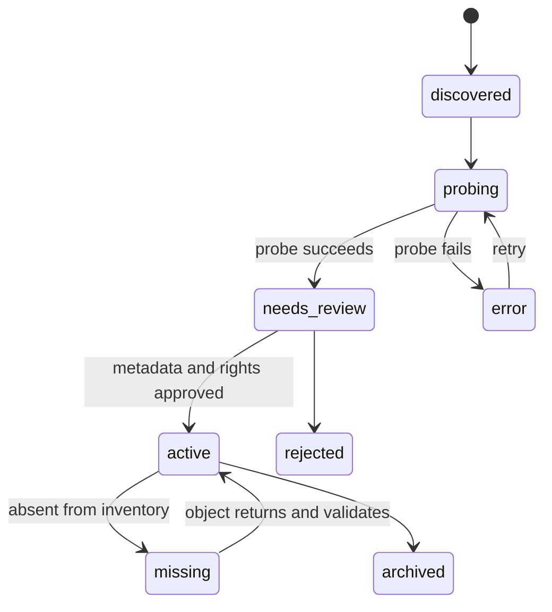

# Ingestion Workflow

## Goal

Turn newly uploaded S3 objects into searchable, validated, rights-aware production assets without changing or overwriting the originals.

## State flow



## Step 1: Inventory

List objects under `ugc-assets/` and capture:

- bucket;
- key;
- size;
- content type;
- ETag;
- version ID when versioning is enabled;
- last modified;
- inventory run timestamp.

Ignore zero-byte folder-marker objects. Ignore `ugc-assets/exported/` as source ingestion unless an explicit re-import mode is enabled.

Upsert by `(bucket_name, s3_key)`. Set `last_seen_at` for present objects. After a complete successful listing, mark previously known but unseen objects `missing`; do not delete database rows.

## Step 2: Classify from path

Use deterministic path parsing only for initial proposals:

- prefix → asset type;
- app path → city and feature;
- B-roll path → category/subcategory/city.

Path-derived values have provenance `path`, not `human`.

Examples:

```text
ugc-assets/app/new-york/map/... → app, new-york, map
ugc-assets/b-roll/food/pizza/new-york/... → broll, food, pizza, new-york
```

## Step 3: Probe media

Download or stream enough of the object for `ffprobe` and record:

- duration in milliseconds;
- width/height;
- display rotation;
- derived orientation;
- average/rational frame rate;
- video/audio codecs;
- audio presence;
- stream count;
- probe version and raw probe JSON.

Reject or quarantine files with no readable video stream. A `.mov` extension alone does not guarantee a compatible codec.

## Step 4: Fingerprint

Calculate SHA-256 over the full object. Use it to identify probable duplicates, not automatically delete them. Optionally add perceptual video fingerprints later.

For the current reaction library, a byte-identical object may intentionally appear
in multiple emotion folders. Register each S3 key for lineage, choose one canonical
media identity per checksum, and mark the others as classification aliases. Union
all folder-derived emotion tags onto the canonical identity. Candidate selection
collapses the group so multiple valid classifications do not become duplicate
editorial weight.

## Step 5: AI enrichment

For selected frames and a short low-resolution proxy, request structured proposals for:

- place/subject;
- shot type;
- camera movement;
- indoor/outdoor;
- day/night;
- people/speech/music;
- visual-quality issues;
- tags and hook concepts;
- suggested usable trim ranges.

Provide path-derived context, but instruct the model not to assume it is correct. Store the raw response and proposed patch in the enrichment table. Never infer rights or consent.

## Step 6: Human review

The reviewer confirms:

- correct city and place;
- type/category/subcategory;
- rights status and source;
- recognizable-person release requirements;
- suitable tags/hooks;
- quality and safe trim;
- whether the asset is city-specific or city-agnostic.

Approval changes status to `active`.

## Step 7: Optional atomization

If a useful master is too long, create short derivatives as new source assets only through an explicit derivative workflow:

- preserve the master;
- write derivatives to the same logical source class using new keys;
- link derivative to parent and trim range;
- assign new asset IDs;
- run normal probe/review.

Do not let the generation worker silently populate the source library.

## Step 8: Reconciliation report

Each inventory run reports:

- discovered;
- unchanged;
- metadata-changed;
- missing;
- probe failures;
- duplicates by checksum;
- needs review;
- activated;
- invalid path patterns.

## Idempotency and concurrency

- Generate a unique inventory-run ID.
- Use database transactions for each object upsert.
- Lock or claim work with `FOR UPDATE SKIP LOCKED`.
- Enrichment and probe jobs use an idempotency key derived from object version plus tool/prompt version.
- Never mark unseen objects missing if the S3 listing was incomplete or failed.

## Security

- Worker IAM should have read access to source prefixes and write access only to the required exported prefix (plus an explicitly approved cache prefix).
- Database credentials come from a secret manager/environment, never repository files.
- Logs must not contain signed S3 URLs or credentials.
